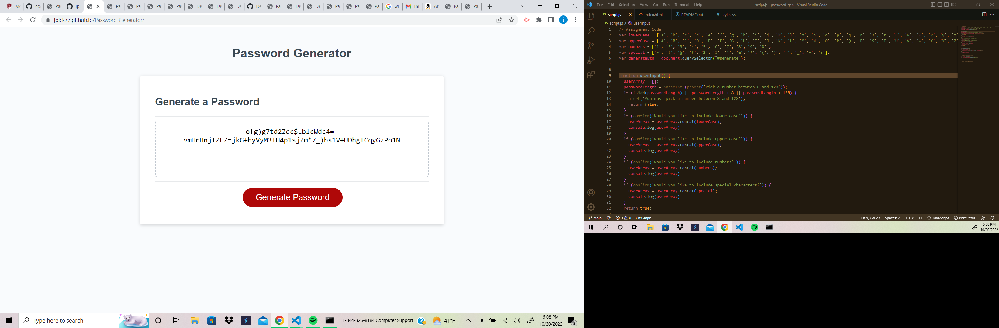
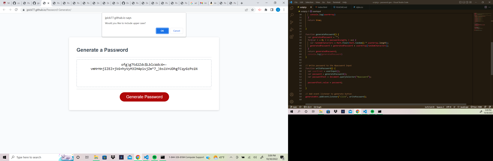
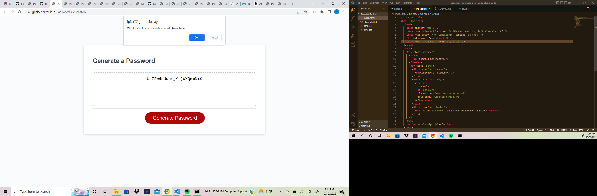

# Description
Here I was given a starter code and was asked to refactor the given code to make the generator more accessible for the user. I used javaScript to insert four diffrent variables, uppercase, lowercase, numbers, special characters. Then I used the function “parseInt” which changes a string to a number. Then I added an alert message if the user did not pick a number between 8 & 128. After that I added a few “if” statments, then confirming if the user wanted to use those diffrent variables. Then console.log those “if” statments. To finish I had to create a “generatePassword” function, and inside of that create a “generatedPassword” variable. I then added a variable for randomCharacters, and added the math.floor(math.random) and userArray to add the math generator together with the userArray. Finally I created a function writePassword, and inside of that variables of userPromt = userInput, password = generatePassword(), passwordText = document.querySelector(“#password”). The querySelector I added will take all the information selected by the user and display the password within the parameters given.

 # Installation
 Used javaScript to add difrrent variables for the password.

 # Link to Deployed Page
 https://jpick77.github.io/Password-Generator/

 # Screenshot of Code and website
 
 
 